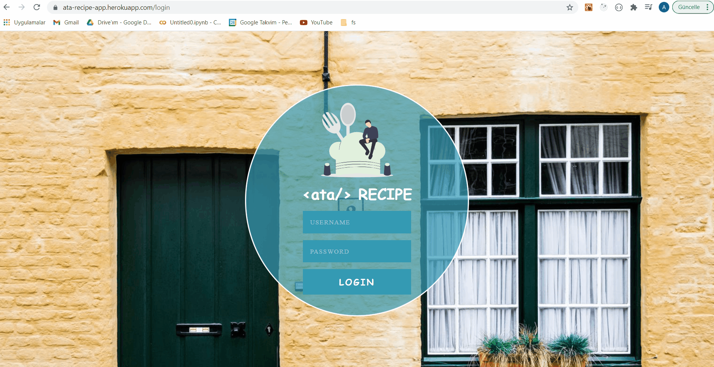

# Recipe App

👉 Authenticating user by using a Private Router, fetching foods user wants, displaying food details once clicked using ReactJS, styled-components, Material-UI

👉 [Recipe-App-Website](https://ata-recipe-app.herokuapp.com/login)

## My Outcome

